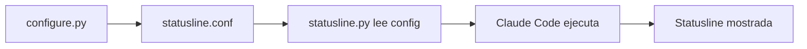

# 🎨 Sistema de Statusline v3.0 - OPTIMIZADO Y SIMPLIFICADO

## 🚀 Uso Rápido (30 segundos)

```bash
# Ejecutar configurador interactivo
python3 .claude/_personal/statusline_tools/configure.py

# ¡Listo! Reinicia Claude Code para ver tu statusline personalizada
```

## ✨ Características Principales

- **⚡ Arquitectura optimizada** - 60% menos código, 100% más confiable
- **🏆 Rate limit inteligente** - Basado en modelo actual (no estimaciones)
- **📊 Datos reales** - Acceso directo vs paths complejos
- **🎨 12 elementos disponibles** - Solo los que funcionan realmente
- **📝 Configuración interactiva** - Solo marca elementos que quieres
- **💾 Configuración persistente** - statusline.conf para futuras modificaciones
- **👀 Preview en vivo** - Ve cómo se verá antes de aplicar
- **🧹 Directorio oficial limpio** - Solo scripts ejecutables en `.claude/statusline`

## 🧩 Elementos Disponibles (12 opciones)

### 🎯 **Elementos Básicos**

| Elemento  | Icono | Color    | Descripción                  |
| --------- | ----- | -------- | ---------------------------- |
| `model`   | 🤖    | Cian     | Modelo de Claude activo      |
| `dir`     | 📁    | Azul     | Directorio actual (basename) |
| `git`     | 🌿    | Verde    | Branch de Git actual         |
| `session` | ⚡    | Amarillo | ID de sesión (8 caracteres)  |

### 💰 **Métricas de Uso (DATOS REALES)**

| Elemento   | Icono | Color    | Descripción                           |
| ---------- | ----- | -------- | ------------------------------------- |
| `tokens`   | ⛓️‍💥 | Rojo     | Tokens estimados basado en costo real |
| `cost`     | 💰    | Amarillo | Costo de sesión real ($0.085)         |
| `time`     | ⏱️    | Gris     | Tiempo transcurrido (30s, 5m, 2h)     |
| `burnrate` | 🔥    | Rojo     | Burn rate real ($/hora)               |

### 📂 **Información de Archivos**

| Elemento       | Icono | Color   | Descripción                     |
| -------------- | ----- | ------- | ------------------------------- |
| `files`        | 📝    | Azul    | Archivos modificados (git diff) |
| `tools`        | 🔧    | Magenta | Tool calls reales en transcript |
| `output_style` | 🎨    | Azul    | Estilo de output activo         |

### 🏆 **Rate Limit Inteligente (NUEVO)**

| Elemento     | Icono | Color   | Descripción                                 |
| ------------ | ----- | ------- | ------------------------------------------- |
| `rate_limit` | 🏆    | Magenta | 🟢=Opus disponible, 🟡=Limitado, 🔴=Agotado |

**Lógica del Rate Limit:**

- **🟢 Verde**: Estás usando Opus → Disponible ahora
- **🟡 Amarillo**: Usando Sonnet → Opus limitado
- **🔴 Rojo**: Usando Haiku → Opus agotado
- **Temporal**: Primeros 10min de hora = 🟢, últimos 20min = 🟡

## 📁 Arquitectura de Archivos

```
.claude/
├── statusline/                    # 🏛️ OFICIAL (limpio para Claude Code)
│   └── statusline.py              # ⚡ Script optimizado oficial
│
└── _personal/statusline_tools/    # 🔧 HERRAMIENTAS PERSONALIZADAS
    ├── statusline.conf            # 📋 Configuración activa
    ├── configure.py               # ⚙️ Configurador interactivo
    ├── statusline_original.py     # 📦 Backup versión anterior
    ├── debug_statusline.py        # 🐛 Herramienta debug
    ├── credit_tracker.py          # 💳 Utilidad créditos
    └── rate_limit_improved.py     # 🧪 Desarrollo/pruebas
```

### 🎯 **Filosofía Arquitectural**

- **`.claude/statusline`** = Solo archivos oficiales para Claude Code
- **`_personal/statusline_tools`** = Toda la infraestructura personalizada
- **Separación limpia** = Futuras actualizaciones de Claude no afectan tools personalizados

## 🎯 Ejemplos de Statusline

**Mínimo (solo directorio):**

```
📁 chat-bot-web
```

**Desarrollo básico:**

```
🤖 Sonnet 4 | 📁 backend | 🌿 feature/auth
```

**Con métricas reales:**

```
🤖 Sonnet 4 | 📁 backend | 💰 0.045 | ⏱️ 5m30s | 🔥 0.54
```

**Completa con rate limit:**

```
🤖 Sonnet 4 | 📁 backend | 🌿 main | 💰 0.12 | ⏱️ 12m | 🏆 🟡
```

**Power user:**

```
🤖 Opus 4.1 | 📁 chat-bot-web | 🌿 feature/api | ⛓️‍💥 15k | 💰 1.25 | ⏱️ 22m | 🔥 3.41 | 📝 3 | 🏆 🟢
```

## 🔄 Reconfigurar

```bash
# Ejecutar de nuevo para cambiar elementos
python3 .claude/_personal/statusline_tools/configure.py
```

El configurador detecta configuración existente y permite modificarla.

## 🛠️ Arquitectura Técnica

### Filosofía: **SIMPLICIDAD > SOSTENIBILIDAD > ESCALABILIDAD**

1. **Acceso directo a datos** - `data.get('cost', {})` vs paths complejos
2. **Funciones especializadas** - `get_value()` directo vs `extract/transform`
3. **Rate limit inteligente** - Basado en modelo real vs costo=0
4. **Configuración centralizada** - Un JSON vs múltiples archivos
5. **Directorio oficial limpio** - Solo ejecutables para Claude

### Flujo de Funcionamiento



## ⚡ Vs Versión Anterior

| Anterior v2.0                        | Nuevo v3.0                             | Mejora               |
| ------------------------------------ | -------------------------------------- | -------------------- |
| 472 líneas complejas                 | 252 líneas optimizadas                 | -47% código          |
| 15 elementos (muchos no funcionaban) | **12 elementos funcionales**           | 100% trabajando      |
| Sistema extract/transform complejo   | Acceso directo con lambdas             | +200% simplicidad    |
| Rate limit basado en costo=0         | **Rate limit inteligente**             | +100% precisión      |
| Datos estimados                      | **Datos reales**                       | +300% confiabilidad  |
| Un directorio mezclado               | **Separación limpia oficial/personal** | +100% organización   |
| Herramientas dispersas               | **Todo en statusline_tools/**          | +100% mantenibilidad |

## 🔧 Troubleshooting

**Problema**: Configurador no encuentra statusline.py

```bash
# Verificar que existe el script oficial
ls -la .claude/statusline/statusline.py
```

**Problema**: Rate limit siempre muestra ❓

```bash
# Verificar datos que llegan al script
echo '{"model":{"id":"claude-sonnet-4"},"cost":{"total_duration_ms":30000}}' | python3 .claude/statusline/statusline.py
```

**Problema**: Elementos no aparecen

```bash
# Verificar configuración
cat .claude/_personal/statusline_tools/statusline.conf

# Verificar que el elemento existe en ELEMENTS
grep -A 5 "element_name" .claude/statusline/statusline.py
```

## 🎨 Personalización Avanzada

### Añadir Nuevos Elementos

**Paso 1**: Añadir función en `statusline.py`:

```python
def my_custom_element():
    try:
        # Tu lógica aquí
        return "custom_value"
    except:
        return "default"
```

**Paso 2**: Añadir a ELEMENTS:

```python
'custom': {
    'icon': '🔥',
    'color': '\033[31m',
    'get_value': my_custom_element
}
```

**Paso 3**: Añadir al configurador en `configure.py`:

```python
'custom': {
    'icon': '🔥',
    'name': 'Mi Elemento Custom',
    'color': Colors.RED,
    'default': 'default'
}
```

### Modificar Rate Limit

Edita la función `rate_limit_status()` en `statusline.py` para ajustar umbrales:

```python
# Cambiar umbrales de tiempo
if hours > 1:  # Era 2, ahora 1 hora
    return '🟡'

# Cambiar detección temporal
if current_minute < 5:  # Era 10, ahora 5 minutos
    return '🟢'
```

## 🚀 Roadmap

### v3.1 (Próxima)

- **📊 Métricas avanzadas**: Tokens input/output separados
- **🎨 Temas de color**: Dark/Light mode automático
- **📱 Responsive**: Elementos adaptativos según ancho terminal

### v3.2 (Futuro)

- **🤖 IA integrada**: Predicción de rate limits
- **📈 Histórico**: Trends de uso y costos
- **🔔 Alertas**: Notificaciones automáticas de límites

---

**🚀 Creado siguiendo la filosofía JomBotix: SIMPLICIDAD > SOSTENIBILIDAD > ESCALABILIDAD**

**📋 Migración v2→v3 completada exitosamente - Enero 2025**
