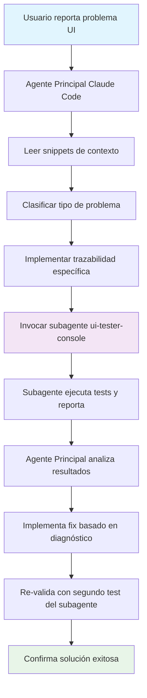
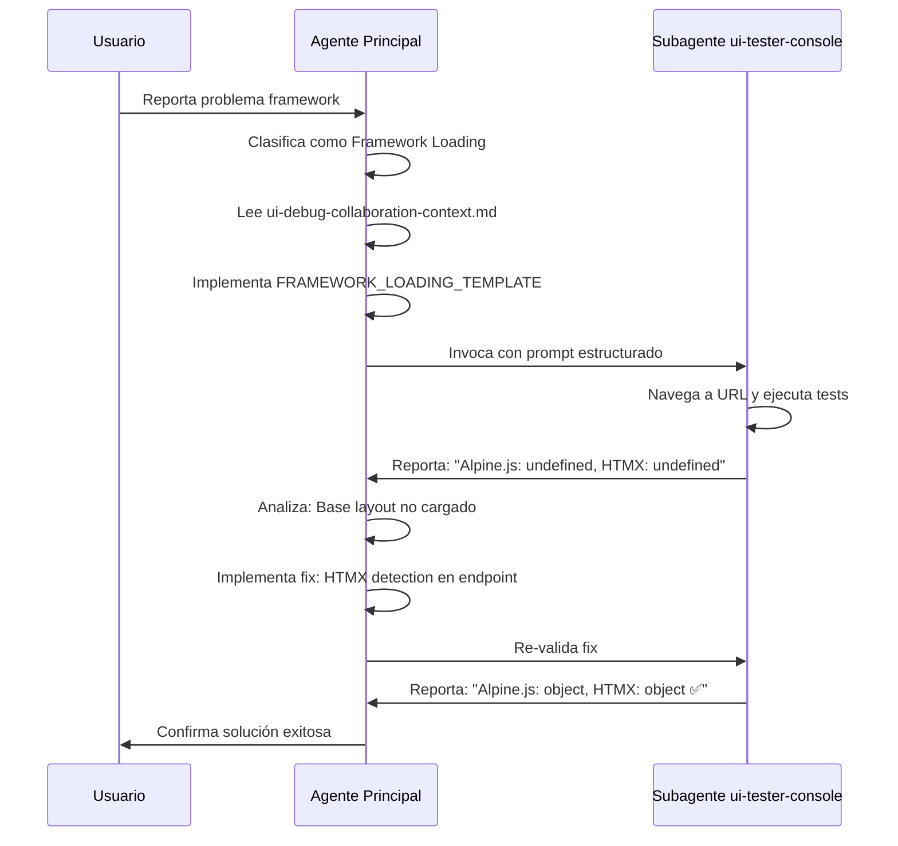
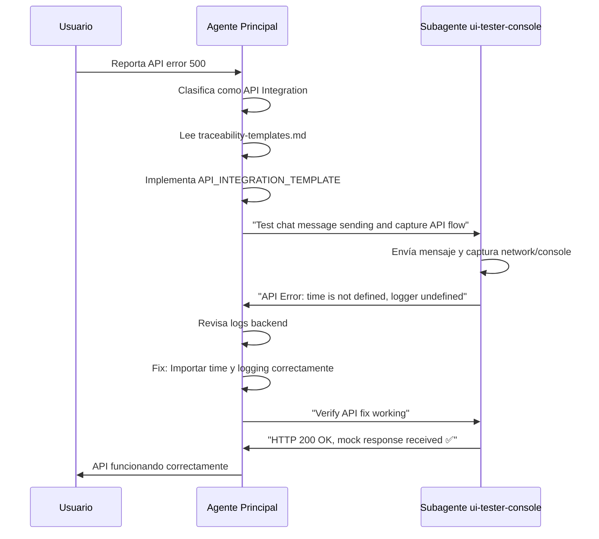

# Guía de Uso: UI Debug Colaborativo con Claude Code

## 🎯 **PROPÓSITO DE ESTA GUÍA**

Esta guía explica **cómo comunicarte con el agente principal (Claude Code)** para activar eficazmente el sistema de debugging colaborativo con el subagente `ui-tester-console`.

## 🏗️ **ARQUITECTURA DEL SISTEMA**



## 📚 **COMPONENTES DEL SISTEMA**

### 🎮 **Comando Principal**
- **Archivo**: `.claude/commands/ui-debug-collaborative.md`
- **Invocación**: `/ui-debug-collaborative [URL] [descripción]`

### 📋 **Snippets de Contexto**
- **`ui-debug-collaboration-context.md`** - Protocolo completo de activación
- **`traceability-templates.md`** - Templates copy/paste para console.log
- **`ui-debug-quick-start.md`** - Guía de activación rápida

### 🤖 **Subagente Especializado**
- **Archivo**: `.claude/agents/ui-tester-console.md`
- **Función**: Ejecutar tests de browser y reportar resultados estructurados

## 🗣️ **CÓMO COMUNICARTE CON EL AGENTE PRINCIPAL**

### 📝 **OPCIÓN 1: COMANDO DIRECTO**

#### Sintaxis:
```
/ui-debug-collaborative "URL_EXACTA" "descripción_del_problema"
```

#### Ejemplos:

```bash
# Framework loading issues
/ui-debug-collaborative "http://localhost:8501/ai-config/chat/1" "Framework loading issues - Alpine.js undefined"

# API integration problems  
/ui-debug-collaborative "http://localhost:8501/widgets/preview" "API returns 500 error when saving"

# Component initialization failures
/ui-debug-collaborative "http://localhost:8501/dashboard" "Buttons not responding, component not initializing"

# Navigation issues
/ui-debug-collaborative "http://localhost:8501/clinics" "HTMX navigation broken, content not loading"
```

### 💬 **OPCIÓN 2: LENGUAJE NATURAL**

#### Frases que activan automáticamente el sistema:

**Para problemas de Framework Loading:**
```
"Los botones no responden"
"Error de undefined en la consola" 
"Alpine.js no funciona"
"Componentes no se inicializan"
```

**Para problemas de API Integration:**
```
"Error 500 en la API"
"El formulario no guarda"
"API request falla"
"Backend no responde"
```

**Para problemas de Navigation:**
```
"HTMX no navega correctamente"
"El contenido no se carga"
"Navigation rota"
"Las páginas no cambian"
```

**Para problemas de Component Issues:**
```
"Los eventos no responden"
"Component no registra"
"Inicialización falla"
"Listeners no funcionan"
```

#### Ejemplos de comunicación natural:

```
🗣️ Usuario: "El chat de la clínica 1 no funciona, cuando hago click en los botones no pasa nada"

🤖 Respuesta esperada:
- Clasificar como: Framework Loading Issue  
- Implementar: FRAMEWORK_LOADING_TEMPLATE
- Invocar: subagente con prompt específico de framework diagnosis
```

```
🗣️ Usuario: "Al guardar el widget me da error 500, revisa qué pasa"

🤖 Respuesta esperada:
- Clasificar como: API Integration Issue
- Implementar: API_INTEGRATION_TEMPLATE  
- Invocar: subagente con prompt específico de API diagnosis
```

## 🎯 **CASOS DE USO DETALLADOS**

### **CASO 1: Framework Loading Issues**

#### Tu mensaje:
```
"El dashboard de AI Config no funciona. Los botones no responden y veo errors de 'chatInterface is not defined' en la consola."
```

#### Flujo esperado del agente:



#### Resultado esperado:
- ✅ Trazabilidad implementada con Steps 1-14
- ✅ Diagnóstico preciso del problema 
- ✅ Fix implementado (ej: HTMX detection en endpoint)
- ✅ Verificación del fix exitosa

### **CASO 2: API Integration Issues**

#### Tu mensaje:
```
"Cuando envío mensajes en el chat me da HTTP 500, necesito que verifiques qué está pasando con la API"
```

#### Flujo esperado:



#### Resultado esperado:
- ✅ Trazabilidad API con Steps 15-21
- ✅ Identificación de causa raíz en backend
- ✅ Fix de imports aplicado
- ✅ Confirmación de API funcionando

### **CASO 3: Component Initialization Issues**

#### Tu mensaje:
```
"Los componentes Alpine.js no se registran correctamente en la página de widgets"
```

#### Resultado esperado:
- ✅ Trazabilidad component lifecycle Steps 30-36
- ✅ Diagnóstico de timing conflicts Alpine/HTMX
- ✅ Fix: Cambio de global functions a Alpine.data()
- ✅ Verificación de component registration exitoso

## 📋 **PROTOCOLO DE COMUNICACIÓN ÓPTIMO**

### ✅ **LO QUE DEBES INCLUIR EN TU MENSAJE**

1. **URL exacta donde ocurre el problema**
```
"En http://localhost:8501/ai-config/chat/1..."
```

2. **Acción específica que falla**
```  
"...cuando hago click en 'Servicios'..."
```

3. **Síntomas observados**
```
"...no pasa nada, no aparece respuesta del AI"
```

4. **Errores de consola (si los ves)**
```
"...veo error 'chatInterface is not defined' en la consola"
```

#### Ejemplo perfecto:
```
🗣️ "En http://localhost:8501/ai-config/chat/1 cuando hago click en el botón 'Servicios' no aparece respuesta del AI. Veo en la consola error 'chatInterface is not defined' y también HTTP 500 errors."
```

### ❌ **LO QUE NO ES ÚTIL**

```
❌ "El chat está roto"
❌ "No funciona bien"  
❌ "Hay errores"
❌ "Revisa la aplicación"
```

### ✅ **MENSAJES DE SEGUIMIENTO ÚTILES**

Durante el proceso puedes decir:

```
✅ "¿Necesitas que pruebe algo específico?"
✅ "¿Quieres que verifique en otra URL?"
✅ "¿El fix está aplicado? ¿Puedo probar?"
✅ "¿Necesitas más información sobre el error?"
```

## 🚀 **FLUJO COMPLETO OPTIMIZADO**

### Paso 1: Tu reporte inicial
```
"El [componente] en [URL] no [acción específica]. Error observado: [síntoma]"
```

### Paso 2: Agente implementa trazabilidad
```
📋 Console.log estratégicos añadidos
🔍 Template específico aplicado según tipo de issue
```

### Paso 3: Invocación del subagente
```
🤖 ui-tester-console ejecuta tests estructurados
📊 Reporta resultados en formato JSON
```

### Paso 4: Análisis y fix
```
🧠 Agente analiza patterns del reporte
🔧 Implementa fix basado en diagnóstico específico
```

### Paso 5: Verificación
```
✅ Segundo test del subagente confirma fix exitoso
🎉 Problema resuelto con evidencia objetiva
```

## ⏱️ **TIEMPOS ESPERADOS**

| Fase | Tiempo Estimado | Total Acumulado |
|------|----------------|-----------------|
| Tu reporte → Clasificación | 30 segundos | 0:30 |
| Implementación trazabilidad | 2 minutos | 2:30 |
| Primer test subagente | 1 minuto | 3:30 |
| Análisis + Fix implementation | 3-5 minutos | 6:30-8:30 |
| Verificación final | 1 minuto | 7:30-9:30 |

**TIEMPO TOTAL: 7-10 minutos** para resolución completa con evidencia

## 🎓 **TIPS PARA MAXIMIZAR EFECTIVIDAD**

### 🎯 **Keywords Mágicas**

Incluye estas palabras en tu mensaje para activación automática:

- **Framework issues**: "undefined", "no responde", "componente", "Alpine", "HTMX"
- **API issues**: "500", "error", "request", "API", "fetch", "backend"  
- **Navigation issues**: "navega", "carga", "swap", "routing", "htmx"
- **Component issues**: "init", "register", "event", "listener", "component"

### 🎪 **Ejemplos de Comunicación Perfecta**

#### Ejemplo A - Framework Issue:
```
🗣️ "En http://localhost:8501/widgets/preview los botones de configuración no responden. Veo en la consola 'Alpine is not defined' y los componentes no se inicializan correctamente."

✅ Resultado: Clasificación automática → Framework Loading → Fix en 8 minutos
```

#### Ejemplo B - API Issue:
```
🗣️ "Al guardar la configuración del widget en http://localhost:8501/widgets/edit/1 me da HTTP 500. La request se envía pero el backend responde con error internal server."

✅ Resultado: Clasificación automática → API Integration → Fix en 7 minutos
```

#### Ejemplo C - Multiple Issues:
```
🗣️ "En http://localhost:8501/ai-config/chat/1 hay múltiples problemas: los frameworks no cargan (Alpine undefined), la API da 500 cuando envío mensajes, y los templates fallan con null pointer exceptions."

✅ Resultado: Clasificación automática → Framework + API + Template safety → Fix completo en 12 minutos
```

## 🚨 **TROUBLESHOOTING**

### Si el agente no activa automáticamente:

**Opción 1 - Comando directo:**
```
/ui-debug-collaborative "http://localhost:8501/problema-url" "descripción específica"
```

**Opción 2 - Referencia explícita:**
```
"Usa el flujo de debugging colaborativo con ui-tester-console para investigar este problema en [URL]"
```

**Opción 3 - Snippet reference:**
```
"Lee el snippet ui-debug-quick-start.md y aplica el protocolo para este issue de [tipo]"
```

### Si necesitas información sobre el sistema:

```
"Explica el flujo de debugging colaborativo disponible"
"¿Qué snippets de trazabilidad están disponibles?"
"¿Cómo funciona la colaboración con ui-tester-console?"
```

## 🎉 **ÉXITO CONFIRMADO**

Sabrás que el sistema funciona correctamente cuando veas:

1. ✅ **Implementación inmediata** de trazabilidad (console.log estratégicos)
2. ✅ **Invocación estructurada** del subagente con prompt específico  
3. ✅ **Reporte detallado** del subagente con datos exactos
4. ✅ **Análisis preciso** de causa raíz vs síntomas
5. ✅ **Fix implementado** basado en evidencia objetiva
6. ✅ **Verificación final** con segundo test del subagente

## 📞 **EJEMPLO DE CONVERSACIÓN COMPLETA**

```
🗣️ TÚ: "El chat de AI Config en http://localhost:8501/ai-config/chat/1 no funciona. Cuando hago click en 'Servicios' no pasa nada."

🤖 AGENTE: "Voy a usar el flujo de debugging colaborativo para investigar. Primero implemento trazabilidad en el template de chat..."

[Implementa console.log estratégicos]

🤖 AGENTE: "Ahora invoco al subagente ui-tester-console para diagnosticar el problema específico."

[Subagente ejecuta tests y reporta]

🤖 AGENTE: "El subagente confirma que Alpine.js y HTMX están undefined. La causa raíz es que el endpoint carga el template sin base layout. Implemento fix..."

[Aplica HTMX detection fix]

🤖 AGENTE: "Fix aplicado. Verifico con segundo test del subagente..."

[Subagente confirma fix exitoso]

🤖 AGENTE: "✅ PROBLEMA RESUELTO: Chat interface completamente funcional. Frameworks cargan correctamente, component registration exitoso, API responde HTTP 200."

⏱️ TIEMPO TOTAL: 8 minutos
```

---

**Con esta guía tienes todo lo necesario para activar eficazmente el sistema de debugging colaborativo y resolver cualquier issue de UI de forma sistemática y rápida.** 🚀