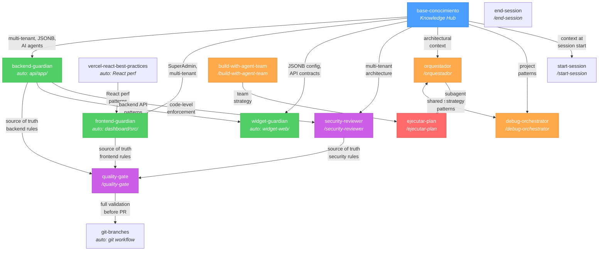
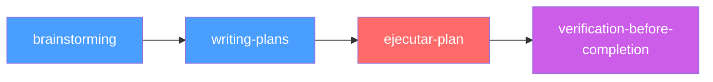

# Skills Ecosystem

## Dependency Graph

## Workflow: Plan Execution

## Skills Index

### Auto-invocadas (se activan por contexto)

| Skill | Trigger | Scope |
|---|---|---|
| `backend-guardian` | Editar `api/app/` | Router→Service→Repo, multi-tenant, tipos |
| `frontend-guardian` | Editar `dashboard/src/` | Componentes, TypeScript, state, shadcn/ui |
| `widget-guardian` | Editar `widget-web/` | Backend-centric, code splitting, sessions |
| `base-conocimiento` | Trabajo en cualquier area | JSONB config, AI agents, chat, email, multi-tenant |
| `vercel-react-best-practices` | Trabajo con React | Performance patterns |

### Invocables (usuario ejecuta con /comando)

| Skill | Uso | Scope |
|---|---|---|
| `/orquestador` | Coordinar subagentes | 9 agentes, delegation rules, workflows |
| `/ejecutar-plan` | Ejecutar un plan .md | Decide subagents/team por paso |
| `/build-with-agent-team` | Build con agent-teams | In-process o split panes, contract-first |
| `/debug-orchestrator` | Debug full-stack | Multi-agente para diagnostico |
| `/quality-gate` | Pre-merge | Checks automaticos + review manual |
| `/security-reviewer` | Audit de seguridad | RLS, CSRF, JWT, multi-tenant |
| `/start-session` | Iniciar sesion | Contexto, commits recientes, breakpoints |
| `/end-session` | Cerrar sesion | Documentacion, cleanup CURRENT_WORK.md |
| `/git-branches` | Git workflow | Ramas, PRs, merge, deploy |

## Posibles mejoras

### `ejecutar-plan`: seleccion de modelo por rol

Actualmente todos los teammates/subagentes heredan el modelo del lead (Opus). Posible mejora:

| Rol | Modelo | Razon |
|---|---|---|
| Lead (ejecutar-plan) | **Opus** | Decide estrategia, coordina, valida |
| Teammates que implementan | **Sonnet** | Escriben codigo igual de bien, mas rapidos |
| Subagentes de research | **Sonnet** | Buscar docs no necesita Opus |

Opus destaca en razonamiento complejo y decisiones arquitectonicas. Para implementacion de codigo, Sonnet da resultados muy similares. Valorar si merece la pena el ahorro de tokens vs simplicidad de "todo Opus".
